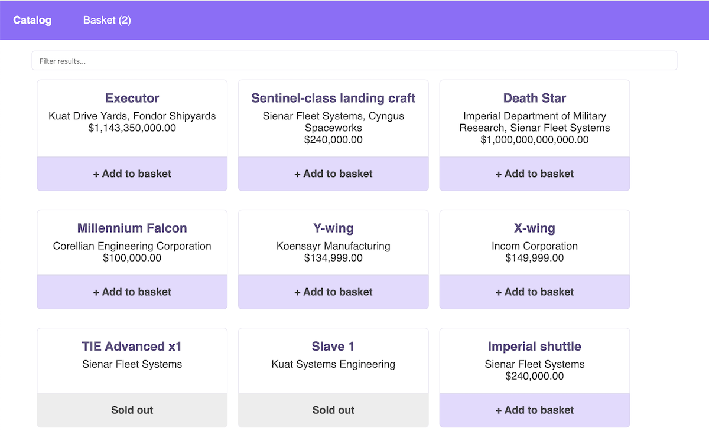

# vue-testing-library-sample

 [](https://standardjs.com) [](https://github.com/facebook/jest) [](https://app.netlify.com/sites/vue-testing-library/deploys)


> A Vue.js project to test [Jest](https://facebook.github.io/jest/) and [Testing-library](https://github.com/testing-library). Data come from [Star Wars API](https://swapi.dev/).

👉 DEMO: [vue-testing-library.netlify.app](https://vue-testing-library.netlify.app/#/)  
👉 BLOG POST: [[maxpou.fr] Vue.js Testing Made it Easy (with Testing Library)](https://www.maxpou.fr/vue-js-testing-library)


## What's inside

* [Vue.js](https://vuejs.org/)
* [vuex](https://vuex.vuejs.org/en/) (state management)
* [vue-router](https://github.com/vuejs/vue-router) (router)
* [Axios](https://github.com/mzabriskie/axios) (a library for XMLHttpRequests)

... For testing:

* [Facebook/Jest](https://facebook.github.io/jest/)
* [Testing-library](https://testing-library.com/docs/vue-testing-library/intro)
* [Jest-dom](https://github.com/testing-library/jest-dom) (Custom jest matchers to test the state of the DOM)
* [eslint-plugin-testing-library](https://github.com/testing-library/eslint-plugin-testing-library) (to write cleaner tests)

## Installation

1. Clone this project. `git clone https://github.com/maxpou/vue-vuex-jest`
2. Install dependencies `npm install`
3. Run the app with `npm start`




To run the test suite, run `npm test`.  
You can also use the following options:

```bash
# Run tests + generate coverage
npm test -- --coverage

# Run tests in watch node
npm test -- --watchAll

# Run tests + update snapshots if needed. There're NO snapshot in this repo.
npm test -- -u
```


Note: this project is based on [vue-cli](https://cli.vuejs.org).


## Coverage


```
> npm test -- --coverage

PASS  tests/unit/catalog.spec.js
Catalog
  ✓ should render (64ms)
  ✓ should show products name, detail and price (43ms)
  ✓ should be able to filter products (46ms)
  ✓ should be able to load more data (62ms)
  ✓ basket should be empty (142ms)
  ✓ should add items to basket (152ms)
  ✓ should load spaceship detail page (123ms)
  ✓ should not load starships when I load a 2nd time the homepage (61ms)


----------------------|----------|----------|----------|----------|-------------------|
File                  |  % Stmts | % Branch |  % Funcs |  % Lines | Uncovered Line #s |
----------------------|----------|----------|----------|----------|-------------------|
All files             |    97.75 |    77.78 |    94.44 |    97.59 |                   |
 src                  |      100 |      100 |      100 |      100 |                   |
  App.vue             |      100 |      100 |      100 |      100 |                   |
  router.js           |      100 |      100 |      100 |      100 |                   |
 src/components       |      100 |      100 |      100 |      100 |                   |
  CatalogList.vue     |      100 |      100 |      100 |      100 |                   |
  CatalogListItem.vue |      100 |      100 |      100 |      100 |                   |
  Navbar.vue          |      100 |      100 |      100 |      100 |                   |
  VPrice.vue          |      100 |      100 |      100 |      100 |                   |
 src/services         |    71.43 |    66.67 |       50 |    71.43 |                   |
  dataFormatter.js    |      100 |      100 |      100 |      100 |                   |
  swapi.api.js        |    33.33 |        0 |        0 |    33.33 |              6,10 |
 src/store            |      100 |      100 |      100 |      100 |                   |
  index.js            |      100 |      100 |      100 |      100 |                   |
  mutation-types.js   |      100 |      100 |      100 |      100 |                   |
 src/store/modules    |      100 |      100 |      100 |      100 |                   |
  basket.js           |      100 |      100 |      100 |      100 |                   |
  catalog.js          |      100 |      100 |      100 |      100 |                   |
 src/views            |      100 |       50 |      100 |      100 |                   |
  Basket.vue          |      100 |      100 |      100 |      100 |                   |
  Catalog.vue         |      100 |       50 |      100 |      100 |                51 |
  StarshipDetail.vue  |      100 |      100 |      100 |      100 |                   |
 tests                |      100 |      100 |      100 |      100 |                   |
  render.js           |      100 |      100 |      100 |      100 |                   |
----------------------|----------|----------|----------|----------|-------------------|
```
